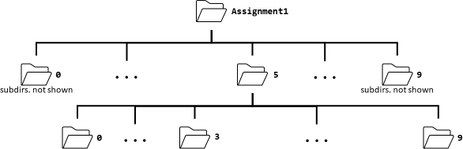
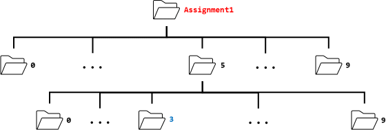
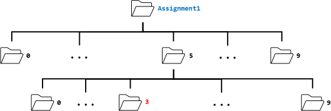
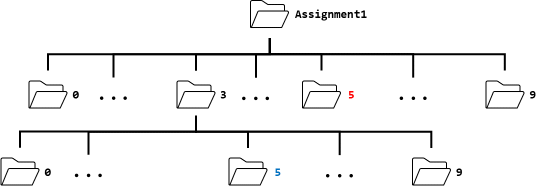
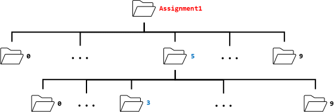

% CISC220 Assignment 1: Bash commands, redirection, piping

# Instructions

Download and save [this plain-text document for your answers](A1answers.txt).
With the exception of Question 11, all of your answers should be a single
line long. Record your answers in the same way as shown in the
answer for Question 0.

When editing the answer file, be sure to use a plain-text editor
(and not something like Word) as the TAs will be copying and
pasting your answers into a terminal to test them.

Submit the file `A1answers.txt` on onq.

# Questions

Suppose that you have a directory `Assignment1`. Inside that directory are
ten directories named `0`, `1`, `2`, ..., `9`. Inside each of the ten
numbered directories are another ten directories `0`, `1`, `2`, ..., `9`.

The figure below shows the structure of the directories. 

0. This question is already answered for you in the answer document;
it appears here so that you can see how you should answer the questions
in this assignment.

    If your current working directory is `Assignment1` then what single command
    would you use to print the absolute path of the current working directory?

1. Consider the last two digits `xy` of your student number. If your
current working directory is `Assignment1` then what single command
would you use to change to the directory named `y` that is inside the
directory named `x` (for example, if the last two digits of your student
number are `53`, then what single command would you use to change
to the directory `3` that is inside the directory `5`)?

    The figure below shows the current working directory in red and the
    directory to change to in blue for the example above:

    

2. If your current working directory is directory `y` from Question 1 then
what single command would you use to change back to the `Assignment1`
directory? Do no use an absolute path in this question; your answer
should not depend on where the `Assignment1` directory is on your filesystem.

    The figure below shows the current working directory in red and the
    directory to change to in blue for the example above:

    

3. If your current working directory is directory `x` from Question 1 then
what single command would you use to change to the directory named `x` that is inside the
directory named `y`? 

    For example, if the last two digits of your student
    number are `53`, then the current working directory is the directory named
    `5` inside of `Assignment1`. Your answer should be a single command that
    starting from the current working directory changes to the directory named `5` 
    inside the directory named `3`.

    The figure below shows the current working directory in red and the
    directory to change to in blue for the example above:

    

4. If your current working directory is `Assignment1` then what single command
would you use to list the regular (non-hidden) files found in the
directory `y` from Question 1?

    For example, if the last two digits of your student
    number are `53`, then the question is asking you to list the files found
    in the directory `3` that is inside the directory `5`.

    The figure below shows the current working directory in red and the
    directory to list the contents of in blue for the example above:

    

5. If your current working directory is `Assignment1` then what single command
would you use to list the regular (non-hidden) files found in the
directories `x` and `y` from Question 1? Here, you want to list all of the files
that are in `x` and all of the files that are in `y`. Note that the files
that are in `x` include the directories `0`, `1`, `2`, ..., `9`.

    The figure below shows the current working directory in red and the
    directories to list the contents of in blue for the example above:

    

6. If your current working directory is directory `y` from Question 1 then
what single command would you use to list the regular (non-hidden) files
in the directory
that have the letter `e` in their name?

    *NOTE*: The particular current working directory is irrelevant
    for Questions 6 through 10.

7. If your current working directory is directory `y` from Question 1 then
what single command would you use to list the regular (non-hidden) files
in the directory
whose names *do not* begin with
a lowercase letter *and do* end with the extension `.txt`? For example,
the file `CISC220.txt` would be listed, but `cisc220.txt` would not be listed.

8. Same as Question 7, except the listed files should appear in reverse
alphabetic order.

9. Same as Question 7, except that the inode number should be output with
the filename and there should be one filename per line of output.

10. If your current working directory is directory `y` from Question 1 then
what single command would you use to list all of the hidden files that
are in the directory (but not the contents of the directories `.` and
`..`)? A hidden file has a filename that begins with a single `.`
(for example, `.ucantseeme`).

11. Suppose that you have a text file named `unsorted.txt` that contains
one word per line and 75 lines (so 75 words). The file was generated by repeatedly
randomly choosing
a word from a list of 50 unique words and adding the chosen word to the end of
the file. If you run the command `uniq unsorted.txt` what can you say
about the number of lines of output produced by the command? Briefly 
explain your answer based on what `uniq` actually does.

12. Suppose that you have a text file named `unsorted.txt` that contains
one word per line. What single command would you use to sort the contents
of the file *in reverse alphabetic order* and then save the sorted output
to a file named `sorted.txt`? *Hint: Use redirection*.

13. What command pipeline would you use to list the most recently modified
file in a directory? If more than one file has the same most recent
modification time then your command should output the file whose name
comes first alphabetically. *Hint: Look up the `head` command*.

14. What command pipeline would you use to list the file
that was modified longest ago in a directory? If more than one file has the same oldest
modification time then your command should output the file whose name
comes *last* alphabetically. *Hint: Look up the `tail` command*.

    *NOTE*: The original version of this question erroneously asked for the name that
    comes first alphabetically. If you answered this version of the question, please
    indicate that you did so on your submission.

15. Run the command:

    `date -I"minutes"`

    and examine the output (and perhaps look at the `date` man page).

    If `date -I"minutes"` is the first command in a pipeline, then what
    complete pipeline would you use to print the time obtained from
    the `date` command to standard output and save the time to a file
    named `time.txt`?

    For example, if `date -I"minutes"` outputs `2021-09-15T22:38-04:00`
    then your pipeline should output the time `22:38` to standard output
    and save the time to the file `time.txt`.